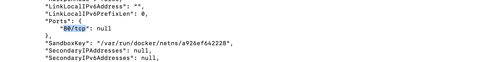
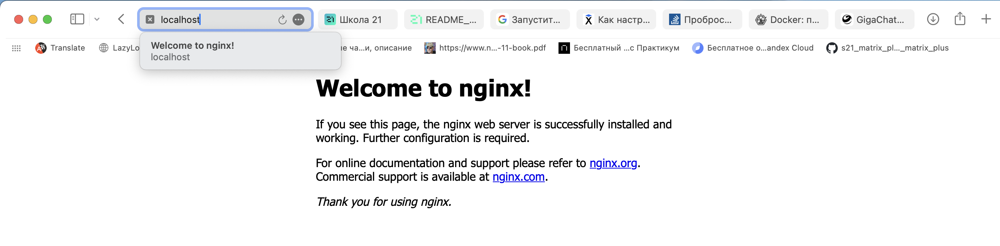

## Part 1

Сначала  запустим Docker


* Возьмем официальный докер-образ с nginx и выкачаем его при помощи docker pull.

```docker pull nginx```


* Проверяем наличие докер-образа через 

 ```docker images```


* Запускаем докер-образ через docker run -d [image_id|repository], а также проверим, что образ запустился через docker ps.

```docker run -d nginx```
```docker ps```


* Посмотрим информацию о контейнере через docker inspect [container_id|container_name]. 

```docker inspect 15b5c07df39e```


размер контейнера


Разница в том, что SizeRootFs - это общий размер всех файлов в контейнере в байтах, в то время как SizeRw - это размер файлов, которые были созданы или изменены, если сравнивать контейнер с его базовым образом. Сразу после создания это значение должно быть равно нулю; по мере изменения (или создания) файлов оно будет увеличиваться.

список замапленных портов



ip контейнера


Также, часть из этого можно посмотреть используя команду ```docker container ls -s```


* Остановим докер образ через docker stop [container_id|container_name] и проверим, что образ остановился через docker ps.

```docker stop 15b5c07df39e```
```docker ps```


* Запустим докер с портами 80 и 443 в контейнере, замапленными на такие же порты на локальной машине, через команду run.

```docker run -d -p 80:80 -p 443:443 nginx```


* Проверим, что в браузере по адресу localhost:80 доступна стартовая страница nginx.



* Перезапустим докер контейнер через docker restart [container_id|container_name] и проверм, что контейнер запустился.

```docker restart b66e07ce9271```
```docker ps```

