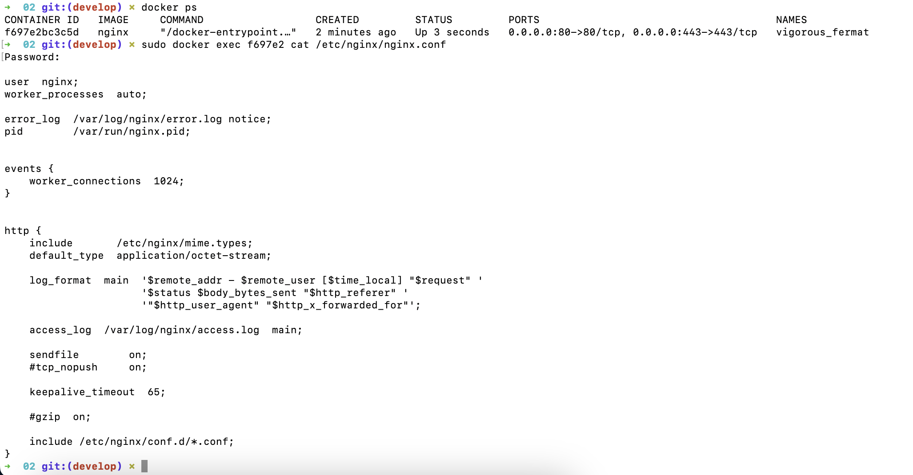

## Part 2

* Прочитаем конфигурационный файл nginx.conf внутри докер контейнера через команду exec.

```docker run -d nginx```
```docker ps```

узнали id контейнера

```docker exec f697e2 cat /etc/nginx/nginx.conf```



* Создадим на локальной машине файл nginx.conf.


* Настроим в нем по пути /status отдачу страницы статуса сервера nginx.


* Скопируем созданный файл nginx.conf внутрь докер-образа через команду docker cp, а также перезапустим nginx внутри докер-образа через команду exec.

```docker cp nginx.conf f697e2:/etc/nginx/nginx.conf```
```docker exec f697e2 nginx -s reload```


* Проверим, что по адресу localhost:80/status отдается страничка со статусом сервера nginx.


* Экспортируем контейнер в файл container.tar через команду export.

```docker export f697e2 > container.tar```


* Остановим контейнер.

```docker stop f697e2```


* Удалим образ через docker rmi [image_id|repository], не удаляя перед этим контейнеры.

```docker rmi -f nginx```


* Удалим остановленный контейнер.

```docker rm f697e2```


* Импортируем контейнер обратно через команду import. И запустим импортированный контейнер.

```docker import -c 'cmd ["nginx", "-g", "daemon off;"]' -c 'ENTRYPOINT ["/docker-entrypoint.sh"]' container.tar nginx```
```docker run -d -p 80:80 -p 443:443 41683089a223```


* Проверим, что по адресу localhost:80/status отдается страничка со статусом сервера nginx.

