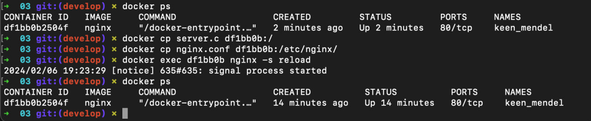
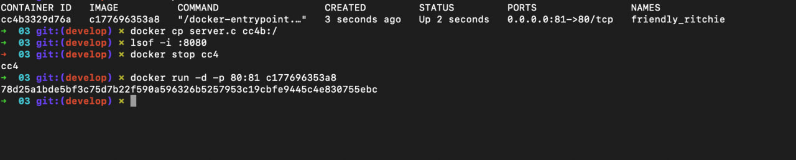
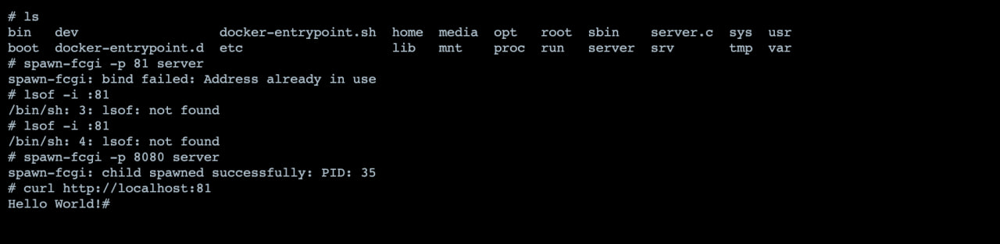
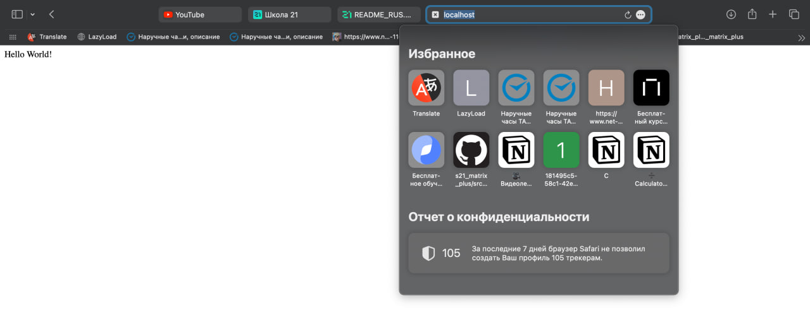

Первым делом запустим докер контейнер и установим в него все, что нам необходимо

```apt update```
```apt upgrade```
```apt install libfcgi-dev libfcgi0ldbl spawn-fcgi gcc```

Перенесем наш сервер и nginx.conf в докер, а затем перезапустим nginx внутри докер-образа через команду exec



Чтобы скомпилировать сервер, используем

```gcc -o server server.c -lfcgi```

Затем запускаем

```spawn-fcgi -p 8080 server```

UPD: Docker контейнер запускаем с маппингом портов 80:81, тогда страница будет отдаваться по адресу http://localhost:80 





